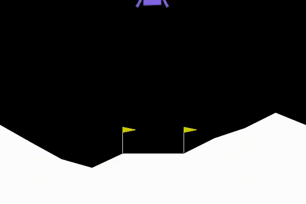
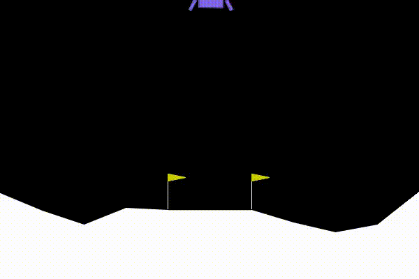
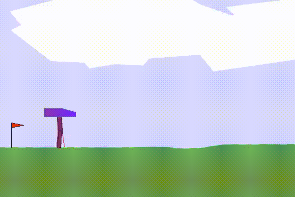

# NeuroEvolution_NEAT

This repository contains my own codeup of the original NEAT, Neuroevolution of Augmenting Topologies paper.
 
Neat is an evolutionary algorithm altering a neural network. Both the weights as well as the topology of the network is changed.

Neat can learn difficult problems without an explicit loss function not solvable by stochastic gradient descent.  
I experiment with NEAT on some of Open AI's training environments:
- Lunar Lander: Land the lander safely between the two flags as fast as possible, use minimal fuel and stay horizontal.
- Walker: Walk as far as possible with limited time given, with minimum activation of limbs.
- Humanoid Standup: try to stand upright from an initial starting position of laying on the back.

Below are the before- and after training videos:

## Lander

## Walker

## Standup

